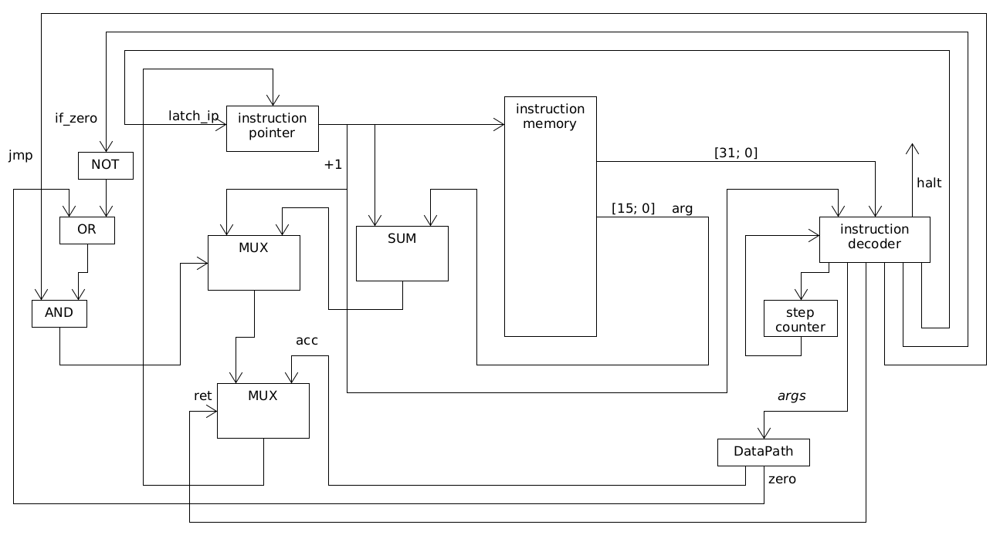

# Milton
Нуцалханов Нуцалхан Гасанович, группа P33101

Вариант: lisp | acc | neum | hw | instr | binary | stream | mem | cstr | prob1 | [4]char
## Nlisp - язык программирования
### Типы данных

1. Целое 32-битное число
2. ASCII символ - заключается в одинарные кавычки
3. Строковый литерал - заключается в двойные кавычки 

С точки зрения функций языка все типы данных - это числа. Символы - это восьмибитные числа, строковые литералы - это указатели на строки в памяти.

### Выражения
#### fn - определение функции
* 1 аргумент - имя функции
* 2 аргумент - аргументы функции в формате ({имя_переменной}[, ...])
* 3 аргумент - выражение
* Пример: `(fn max (a b) (case (> a b) a b))`
* Пример вызова функции: (max 15 10)
* Определение функции является выражением, потому возвращает значение; в случае определения функции это всегда 0

#### case - условный оператор
* 1 аргумент - выражение условия
* 2 аргумент - выражение, выполняющееся, если выражение условия не равно нулю
* 3 аргумент - выражение, выполняющееся в ином случае
* Пример: `(case (% i 2) (print "i is odd") (print "i is even"))`

#### let - объявление локальной переменной
* 1 аргумент - имя переменной
* 2 аргумент - выражение, инициализирующее переменную
* 3 аргумент - основное выражение, которое имеет доступ к переменной
* Пример: `(let l (* 10 32) (print_int l))`
* Выражение возвращает результат внутреннего основного выражения

#### for - оператор цикла
* 1 аргумент - имя переменной; переменная по умолчанию инициализируется значением 0
* 2 аргумент - выражение, возвращающее следующее значение перменной; внутри можно обращаться к переменной
* 3 аргумент - условное выражение; основное выражение повторяется, если это выражение не равно нулю
* 4 аргумент - основное выражение, которое выполняется в цикле
* Пример: `(for i (+ i 5) (< i 100) (print_int i))`
* Выражение for возвращает сумму основных выражений

#### Переменные
В функциях, в цикле `for` или в выражении `let` могут быть объявлены переменные. Их область видимости - локальная.

Затенения переменных нет, потому нельзя назвать переменную каким-то именем, если она уже объявлена. Также нельзя называть переменную именем уже объявленной функции.

### Функции
Функции могут быть объявлены где и когда угодно. Их область видимости - глобальная. Однако если обратиться к функции в коде раньше ее объявления, то такая программа не скомпилируется.

Из функций нельзя обращаться к внешним переменным - только к аргументам и объявленным внутри переменным.

#### Встроенные функции
* `(fn sign (a))` - возвращает 1, если аргумент отрицательный, иначе - 0
* `(fn & (a b))` - побитовая конъюнкцию двух чисел
* `(fn | (a b))` - побитовая дизъюнкцию двух чисел
* `(fn + (a b))` - сумма двух чисел
* `(fn - (a b))` - разность двух чисел
* `(fn * (a b))` - произведение двух чисел
* `(fn / (a b))` - отношение двух чисел
* `(fn % (a b))` - остаток от деления первого числа на второе
* `(fn in ())` - возвращает 1 символ из потока чтения
* `(fn out (a))` - записывает символ в поток вывода, возвращает 0
* `(fn read ())` - возвращает указатель на введенную строку
* `(fn print (a))` - принимает указатель строки, возвращает ее длину
* `(fn print_positive_int (a))` - выводит положительное число без ведущих нулей в десятичном формате в поток вывода

#### Стандартная библиотека
1. `(fn ! (a))` - возвращает 1, если число равно нулю, иначе - 0
2. `(fn != (a b))` - возвращает 1, если числа не равны, иначе - 0
3. `(fn == (a b))` - возвращает 1, если числа равны, иначе - 1
4. `(fn > (a b))` - возвращает 1, если первое число больше второго, иначе - 0
5. `(fn < (a b))` - возвращает 1, если первое число меньше второго, иначе - 0
6. `(fn >= (a b))` - возвращает 1, если первое число больше или равно второму, иначе - 0
7. `(fn <= (a b))` - возвращает 1, если первое число меньше или равно второму, иначе - 0
8. `(fn print_int (a))` - записывает в поток вывода целое число в десятичном представлении без ведущих нулей

### Формальное описание синтаксиса
* program := {(expression)}
* expression := fn_def | for | case | fn_call | var_ref | int | char | literal | "(", expression, ")"
* fn_def := "fn", name, args, expression
* args := ({name})
* name := "(-[^\d]*)|([^\d]{1}.*)"
* for := "for", name, expression, expression, expression
* case := "case", expression, expression, expression
* fn_call := name, {name}
* var_ref := name
* int := "-?[\d]+"
* char := "'.'"
* literal := "".*""

### Семантика
У языка Nlisp аппликативный порядок вычислений, то есть слева направо и изнутри наружу.

## Компилятор Nlisp
TODO

## Организация памяти
1. Память разделена на память инструкций и память данных
2. В них по 65536 ячеек памяти, соответственно адрес - это 16 бит
3. Память инструкций состоит из ячеек по 4 байта
4. Память данных состоит из ячеек по байту
5. Little-Endian
6. Основной регистр всего один - это аккумулятор
7. Есть и дополнительные: указатель инструкции и указатель стэка
8. Адрес возврата перед вызовом функции кладется на стэк. Аргументы функции кладутся на стэк
9. Первые 4 байта - порт ввода. Запись не дает никакого эффекта
10. Вторые 4 байта - порт вывода. Чтение всегда возвращает 0
11. Третьи 4 байта - bump указатель. Обычно в скомпилированной программе указывает на ячейку после статических данных
12. После них располагаются статические строковые литералы, символы и числа
13. Есть стэк. Он находится в памяти данных и идет с конца

## Система команд
1. Машинное слово - 32 бита
2. Организация команды:
    * Биты [31; 24] - номер инструкции
    * Биты [23; 0] - аргумент инструкции
3. Инструкции
    * 00: `sign` - записывает в аккумулятор знак значения из аккумулятора, аргумент игнорируется
    * 01: `and` - записывает в аккумулятор побитовую конъюнкцию значений из аккумулятора и аргумента 
    * 02: `or` - записывает в аккумулятор побитовую дизъюнкцию значений из аккумулятора и аргумента
    * 03: `add` - записывает в аккумулятор сумму значений из аккумулятора и аргумента
    * 04: `sub` - записывает в аккумулятор разность значений из аккумулятора и аргумента
    * 05: `mul` - записывает в аккумулятор произведение значений из аккумулятора и аргумента
    * 06: `div` - записывает в аккумулятор отношение значений из аккумулятора и аргумента
    * 07: `rem` - записывает в аккумулятор остаток от деления значения из аккумулятора на аргумент
    * 08: `jump` - безусловный переход относительно указателя инструкции на значение из аргумента
    * 09: `jifz` - переход относительно указателя инструкции на значение из аргумента, если значение в аккумуляторе равно нулю, иначе на следующую инструкцию
    * 0A: `call` - вызов функции: адрес следующей инструкции ставится на стэк, указатель инструкции сдвигается на аргумент. Аккумулятор становится равен адресу следующей после `call` инструкции
    * 0B: `ret` - возврат из функции: указатель инструкции устанавливается на значение из стэка, после чего это значение снимается со стэка
    * 0C: `spadd` - прибавляет к значению указателя стэка значение аргумента. Оно может быть отрицательным
    * 0D: `load` - записывает в аккумулятор значение аргумента
    * 0E: `save` - сохраняет значение из аккумулятора в ячейку по адресу из аргумента
    * 0F: `halt` - сигнал остановки, аргумент игнорируется
4. Режимы адресации
    * Прямая адресация
    * Адресация относительно указателя стэка
    * Непосредственная загрузка
    * Использование значения из аккумулятора
5. Организация аргумента инструкции:
    * Биты [23; 22] - Режим адресации
        * 00: Прямая адресация - будет возвращено значение из ячейки памяти данных по адресу из значения аргумента
        * 01: Адресация относительно указателя стэка - будет возвращено значение из ячейки памяти данных, адрес которой равен сумме значения аргумента и указателя стэка 
        * 10: Непосредственная загрузка - будет возвращено значение из аргумента
        * 11: Использование значения из аккумулятора - будет возвращено значение из аккумулятора; значение аргумента игнорируется
    * Биты [21; 16] - Зарезервированы
    * Биты [15; 0] - Значение аргумента

## Процессор
### Консольное приложение
TODO

### DataPath

Входные данные:
* `write` - Записывать ли по адресу
* `arg` - Значение аргумента инструкции
* `addr_mode` - Режим адресации: представляется двумя битами
* `latch_stack` - Защелкивать ли новое значение стэка
* `latch_acc` - Защелкивать ли новое значение аккумулятора
* `alu_op` - Операция, которую выполнит ALU: sign, and, or, add, sub, mul, div, rem, left, right
* `extend_arg` - Расширять ли знак значения аргумента

Выходные данные:
* `acc` - Значение аккумулятора
* `zero` - Является ли значение аккумулятора нулем

### ControlUnit

Флаги управления:
* `jmp` - Совершать ли переход относительно значения аргумента
* `if_zero` - Совершать ли переход относительно значения аргумента только если значение в аккумуляторе равно нулю. Для перехода `jmp` должен быть true
* `latch_ip` - Сохранять ли новое значение указателя инструкции
* `ret` - Совершать ли переход по значению из аккумулятора

Выходные сигналы:
* `halt` - Сигнал остановки
