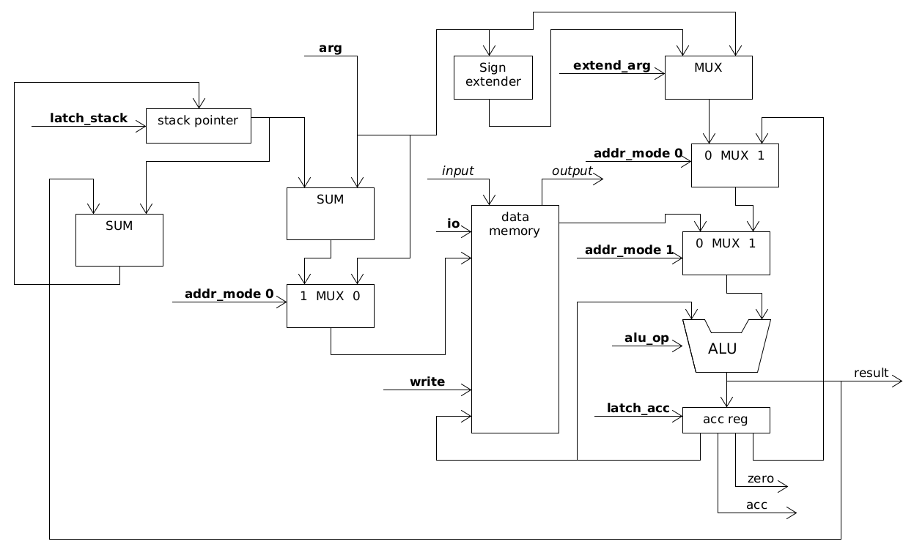
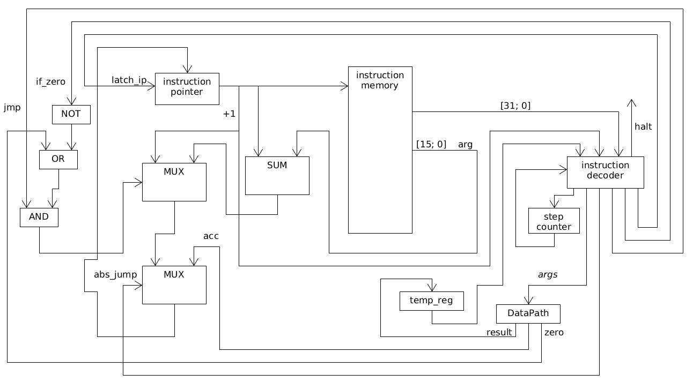

# Milton
Нуцалханов Нуцалхан Гасанович, группа P33101

Вариант: lisp | acc | neum | hw | instr | binary | stream | mem | cstr | prob1 | [4]char
## Nlisp - язык программирования
### Типы данных

1. Целое 32-битное число
2. ASCII символ - заключается в одинарные кавычки
3. Строковый литерал - заключается в двойные кавычки 

С точки зрения функций языка все типы данных - это числа. Символы - это восьмибитные числа, строковые литералы - это указатели на строки в памяти.

### Выражения
#### fn - определение функции
* 1 аргумент - имя функции
* 2 аргумент - аргументы функции в формате ({имя_переменной}[, ...])
* 3 аргумент - выражение
* Пример: `(fn max (a b) (case (> a b) a b))`
* Пример вызова функции: (max 15 10)
* Определение функции является выражением, потому возвращает значение; в случае определения функции это всегда 0

#### case - условный оператор
* 1 аргумент - выражение условия
* 2 аргумент - выражение, выполняющееся, если выражение условия не равно нулю
* 3 аргумент - выражение, выполняющееся в ином случае
* Пример: `(case (% i 2) (print "i is odd") (print "i is even"))`

#### let - объявление локальной переменной
* 1 аргумент - имя переменной
* 2 аргумент - выражение, инициализирующее переменную
* 3 аргумент - основное выражение, которое имеет доступ к переменной
* Пример: `(let l (* 10 32) (print_int l))`
* Выражение возвращает результат внутреннего основного выражения

#### for - оператор цикла
* 1 аргумент - имя переменной; переменная по умолчанию инициализируется значением 0
* 2 аргумент - выражение, возвращающее следующее значение перменной; внутри можно обращаться к переменной
* 3 аргумент - условное выражение; основное выражение повторяется, если это выражение не равно нулю
* 4 аргумент - основное выражение, которое выполняется в цикле
* Пример: `(for i (+ i 5) (< i 100) (print_int i))`
* Выражение for возвращает сумму основных выражений

#### Переменные
В функциях, в цикле `for` или в выражении `let` могут быть объявлены переменные. Их область видимости - локальная.

Затенения переменных нет, потому нельзя назвать переменную каким-то именем, если она уже объявлена. Также нельзя называть переменную именем уже объявленной функции.

### Функции
Функции могут быть объявлены где и когда угодно. Их область видимости - глобальная. Однако если обратиться к функции в коде раньше ее объявления, то такая программа не скомпилируется.

Из функций нельзя обращаться к внешним переменным - только к аргументам и объявленным внутри переменным.

#### Встроенные функции
* `(fn sign (a))` - возвращает 1, если аргумент отрицательный, иначе - 0
* `(fn & (a b))` - побитовая конъюнкцию двух чисел
* `(fn | (a b))` - побитовая дизъюнкцию двух чисел
* `(fn + (a b))` - сумма двух чисел
* `(fn - (a b))` - разность двух чисел
* `(fn * (a b))` - произведение двух чисел
* `(fn / (a b))` - отношение двух чисел
* `(fn % (a b))` - остаток от деления первого числа на второе
* `(fn in ())` - возвращает 1 символ из потока чтения
* `(fn out (a))` - записывает символ в поток вывода, возвращает этот же символ
* `(fn read ())` - возвращает указатель на введенную строку
* `(fn print (a))` - принимает указатель строки, возвращает 0
* `(fn print_positive_int (a))` - выводит положительное число без ведущих нулей в десятичном формате в поток вывода

#### Стандартная библиотека
1. `(fn ! (a))` - возвращает 1, если число равно нулю, иначе - 0
2. `(fn != (a b))` - возвращает 1, если числа не равны, иначе - 0
3. `(fn == (a b))` - возвращает 1, если числа равны, иначе - 1
4. `(fn > (a b))` - возвращает 1, если первое число больше второго, иначе - 0
5. `(fn < (a b))` - возвращает 1, если первое число меньше второго, иначе - 0
6. `(fn >= (a b))` - возвращает 1, если первое число больше или равно второму, иначе - 0
7. `(fn <= (a b))` - возвращает 1, если первое число меньше или равно второму, иначе - 0
8. `(fn print_int (a))` - записывает в поток вывода целое число в десятичном представлении без ведущих нулей

### Формальное описание синтаксиса
* program := {(expression)}
* expression := fn_def | for | case | fn_call | var_ref | int | char | literal | "(", expression, ")"
* fn_def := "fn", name, args, expression
* args := ({name})
* name := "(-[^\d]*)|([^\d]{1}.*)"
* for := "for", name, expression, expression, expression
* case := "case", expression, expression, expression
* fn_call := name, {name}
* var_ref := name
* int := "-?[\d]+"
* char := "'.'"
* literal := "".*""

### Семантика
У языка Nlisp аппликативный порядок вычислений, то есть слева направо и изнутри наружу.

## Компилятор Nlisp
`nlisp <путь_до_исходного_кода> <имя_бинарного_файла>` 
#### Входные данные:
* Имя файла с исходным кодом в текстовом виде.
* Имя файла для сохранения полученного машинного кода.

#### Выходные данные:
* В поток ошибок записывается ассемблерное представление кода
* В поток ошибок записываются количества строк кода в реализации алгоритма, количество инструкций и количество байтов в бинарном файле в целом
* В файл записывает байткод программы

### Основные этапы компиляции
1. Парсинг кода и построение абстрактного синтаксического дерева. Вне зависимости от пользовательского кода всегда компилируется и стандартная библиотека функций языка. 
2. Компиляция программы из дерева в байткод. Каждое выражение изнутри наружу раскрывается в байткод.

## Организация памяти
1. Память разделена на память инструкций и память данных
2. В них по 65536 ячеек памяти, соответственно адрес - это 16 бит
3. Память инструкций состоит из ячеек по 4 байта
4. Память данных состоит из ячеек по байту
5. Little-Endian
6. Основной регистр всего один - это аккумулятор
7. Есть и дополнительные: указатель инструкции, указатель стэка, а также временный регистр, который хранит результаты вычислений ALU 
8. Адрес возврата перед вызовом функции кладется на стэк. Аргументы функции кладутся на стэк перед вызовом функции
9. Первые 4 байта - порт ввода. Запись не дает никакого эффекта
10. Вторые 4 байта - порт вывода. Чтение всегда возвращает 0
11. Третьи 4 байта - bump указатель. Обычно в скомпилированной программе указывает на ячейку после статических данных
12. После них располагаются статические строковые литералы, символы и числа
13. Есть стэк. Он находится в памяти данных и идет с конца
14. Все функции располагаются в памяти инструкций

### Ответы на некоторые вопросы
1. В каких случаях литерал будет использован при помощи непосредственной адресации? - *В любых. Все функции для работы с литералами оперируют ссылками на строки в памяти*
2. В каких случаях литерал будет сохранён в статическую память? - *В любых*
3. Как будут размещены литералы, сохранённые в статическую память, друг относительно друга? - *Друг за другом, разделенные нуль терминатором*
4. Как будет размещаться в память литерал, требующий для хранения несколько машинных слов? - *Каждый символ занимает 1 байт*
5. В каких случаях переменная будет отображена на регистр? - *Ни в каких. Переменные отображаются непосредственно на память, на стэк или загружаются непосредственно из аргумента инструкции*
6. В каких случаях переменная будет отображена на статическую память? - *Если переменная - это ссылка на строку или же если значение переменной не влезает в 16 бит. Иначе она будет загружаться непосредственно из аргумента инструкции*
7. В каких случаях переменная будет отображена на стек? - *Если эта переменная - аргумент функции*

## Система команд
1. Машинное слово - 32 бита
2. Организация команды:
    * Биты [31; 24] - номер инструкции
    * Биты [23; 0] - аргумент инструкции
3. Инструкции
    * 00: `sign` - записывает в аккумулятор знак значения аргумента
    * 01: `and` - записывает в аккумулятор побитовую конъюнкцию значения из аккумулятора и аргумента 
    * 02: `or` - записывает в аккумулятор побитовую дизъюнкцию значения из аккумулятора и аргумента
    * 03: `add` - записывает в аккумулятор сумму значения из аккумулятора и аргумента
    * 04: `sub` - записывает в аккумулятор разность значения из аккумулятора и аргумента
    * 05: `mul` - записывает в аккумулятор произведение значения из аккумулятора и аргумента
    * 06: `div` - записывает в аккумулятор отношение значения из аккумулятора и аргумента
    * 07: `rem` - записывает в аккумулятор остаток от деления значения из аккумулятора на аргумент
    * 08: `jump` - безусловный переход относительно указателя инструкции на значение из аргумента
    * 09: `jifz` - переход относительно указателя инструкции на значение из аргумента, если значение в аккумуляторе равно нулю, иначе на следующую инструкцию
    * 0A: `call` - вызов функции: адрес следующей инструкции ставится на стэк, указатель инструкции сдвигается на аргумент. Аккумулятор становится равен адресу следующей после `call` инструкции
    * 0B: `ret` - возврат из функции: указатель инструкции устанавливается на значение из стэка, после чего это значение снимается со стэка
    * 0C: `spadd` - прибавляет к значению указателя стэка значение аргумента. Оно может быть отрицательным
    * 0D: `load` - записывает в аккумулятор аргумент
    * 0E: `save` - сохраняет значение из аккумулятора в ячейку из аргумента. Может быть только прямая адресация и адресация относительно стэка 
    * 0F: `ldrel` - записывает в аккумулятор значение по адресу из аргумента
    * 10: `svrel` - сохраняет значение из аккумулятор в ячейку по адресу из аргумента
    * 11: `halt` - сигнал остановки, аргумент игнорируется
4. Режимы адресации
    * Прямая адресация
    * Адресация относительно указателя стэка
    * Непосредственная загрузка
    * Использование значения из аккумулятора
5. Организация аргумента инструкции:
    * Биты [23; 22] - Режим адресации
        * 00: Прямая адресация - будет возвращено значение из ячейки памяти данных по адресу из значения аргумента
        * 01: Адресация относительно указателя стэка - будет возвращено значение из ячейки памяти данных, адрес которой равен сумме значения аргумента и указателя стэка 
        * 10: Непосредственная загрузка - будет возвращено значение из аргумента
        * 11: Косвенная адресация - будет возвращено значение по адресу из аргумента
    * Биты [21; 16] - Зарезервированы
    * Биты [15; 0] - Значение аргумента

## Основные правила построения ассемблерного кода
1. Все выражения просто меняют значение аккумулятора
2. Аргументы функции ставятся на стэк
3. Все переменные также находятся на стэке
4. Символы сохраняются прямо в слове инструкции. Используется непосредственная загрузка
5. Если число не помещается в 16 бит, то оно статически хранится в памяти, а в инструкции хранится адрес на эту ячейку. Иначе число сохраняется непосредственно в слово инструкции

## Процессор
### Консольное приложение
`milton <путь_до_бинарного_файла> <аргументы>[...]`
#### Входные данные
* Имя бинарного файла
* Аргументы программы

#### Выходные данные
* В стандартный поток вывода записывается вывод программы
* В поток ошибок записываются выполненные инструкции и состояния регистров перед выполнением инструкций
* В поток ошибок записываются количества выполненных тактов и инструкций

Если необходимо видеть только вывод программы, то можно подавить вывод ошибок с помощью перенаправления потока в /dev/null.

### DataPath


Входные данные:
* `write` - Записывать ли по адресу
* `arg` - Значение аргумента инструкции
* `addr_mode` - Режим адресации: представляется двумя битами
* `latch_stack` - Защелкивать ли новое значение стэка
* `latch_acc` - Защелкивать ли новое значение аккумулятора
* `alu_op` - Операция, которую выполнит ALU: sign, and, or, add, sub, mul, div, rem, right
* `extend_arg` - Расширять ли знак значения аргумента
* `io` - Выполнять ли ввод/вывод данных

Выходные данные:
* `acc` - Значение аккумулятора
* `result` - Результат вычисления ALU
* `zero` - Является ли значение аккумулятора нулем

### ControlUnit


Флаги управления:
* `jmp` - Совершать ли переход относительно значения аргумента
* `if_zero` - Совершать ли переход относительно значения аргумента только если значение в аккумуляторе равно нулю. Для перехода `jmp` должен быть true
* `latch_ip` - Сохранять ли новое значение указателя инструкции
* `abs_jump` - Совершать ли переход по значению из аккумулятора

Выходные сигналы:
* `halt` - Сигнал остановки

## Тестирование
Запуск тестов:
```
cargo test
```

Реализованы [юнит тесты ControlUnit'а](milton/controlunit.rs).

Также реализованы [Golden тесты](tests/golden.rs) программ:
* [`hello`](tests/golden/hello.yaml) 
* [`hello_user_name`](tests/golden/hello_user_name.yaml) 
* [`cat`](tests/golden/cat.yaml) 
* [`prob1`](tests/golden/prob1.yaml)

В Golden тестах выводятся последние 100 строк дебаг вывода компилятора и виртуальной машины.

## CI

## Полный цикл на примере prob1
Исходный код:
```
(print_int (
    for el (+ el 1) (< el 1000) (case (| (! (% el 3)) (! (% el 5)))
        el
        0
    )
))
```
Код записан в файл `prob1.nl`. Компилируем с помощью команды
```cargo run --bin nlisp prob1.nl prob1```

Соотвественно на выход получаем скомпилированный бинарник `prob1`. В поток ошибок же выведется ассемблерное представление скомпилированного кода.

Последние 30 строк потока ошибок:
```
227 0c800004 spadd 4
228 0e400004 save ~ 4
229 0c80fffc spadd -4
230 0c80fff8 spadd -8
231 0d00000c load # 12
232 0e400004 save ~ 4
233 0d800005 load 5
234 0e400000 save ~ 0
235 0a000015 call 21
236 0c800008 spadd 8
237 0e400000 save ~ 0
238 0a00004f call 79
239 0c800004 spadd 4
240 0e400000 save ~ 0
241 0a000006 call 6
242 0c800008 spadd 8
243 09000003 jifz 3
244 0d00000c load # 12
245 08000002 jump 2
246 0d800000 load 0
247 03400000 add ~ 0
248 0e400000 save ~ 0
249 0800ffcf jump -49
250 0d400000 load ~ 0
251 0c800004 spadd 4
252 0e400000 save ~ 0
253 0a0000a1 call 161
254 0c800004 spadd 4
255 11000000 halt
Code lines: 6; instructions: 256; bytes: 1040
```

Запуск программы с помощью команды
```cargo run --bin milton prob1```

Ее стандартный вывод:
```
233168
```

Последние 30 строк ее потока ошибок:
```
jifz 6        ip: 71, acc: 51, sp: 65495
save # 4        ip: 72, acc: 51, sp: 65495
spadd 4        ip: 73, acc: 51, sp: 65495
jump -4        ip: 74, acc: 51, sp: 65499
load ~ 0        ip: 70, acc: 51, sp: 65499
jifz 6        ip: 71, acc: 49, sp: 65499
save # 4        ip: 72, acc: 49, sp: 65499
spadd 4        ip: 73, acc: 49, sp: 65499
jump -4        ip: 74, acc: 49, sp: 65503
load ~ 0        ip: 70, acc: 49, sp: 65503
jifz 6        ip: 71, acc: 54, sp: 65503
save # 4        ip: 72, acc: 54, sp: 65503
spadd 4        ip: 73, acc: 54, sp: 65503
jump -4        ip: 74, acc: 54, sp: 65507
load ~ 0        ip: 70, acc: 54, sp: 65507
jifz 6        ip: 71, acc: 56, sp: 65507
save # 4        ip: 72, acc: 56, sp: 65507
spadd 4        ip: 73, acc: 56, sp: 65507
jump -4        ip: 74, acc: 56, sp: 65511
load ~ 0        ip: 70, acc: 56, sp: 65511
jifz 6        ip: 71, acc: 0, sp: 65511
spadd 4        ip: 77, acc: 0, sp: 65511
ret        ip: 78, acc: 0, sp: 65515
ret        ip: 78, acc: 0, sp: 65519
spadd 4        ip: 193, acc: 0, sp: 65519
ret        ip: 194, acc: 0, sp: 65523
ret        ip: 194, acc: 0, sp: 65527
spadd 4        ip: 254, acc: 0, sp: 65527
halt        ip: 255, acc: 0, sp: 65531
Ticks: 123009; instructions: 87003
```

Запуск тестов с помощью команды `cargo test`:
```
    Finished test [unoptimized + debuginfo] target(s) in 0.01s
     Running unittests src/lib.rs (target/debug/deps/vm-52682d49045c288c)

running 0 tests

test result: ok. 0 passed; 0 failed; 0 ignored; 0 measured; 0 filtered out; finished in 0.00s

     Running unittests milton/main.rs (target/debug/deps/milton-691972dcba738bc1)

running 6 tests
test controlunit::test::rel ... ok
test controlunit::test::in_out ... ok
test controlunit::test::jumps ... ok
test controlunit::test::ops ... ok
test controlunit::test::call_ret ... ok
test controlunit::test::sign_spadd ... ok

test result: ok. 6 passed; 0 failed; 0 ignored; 0 measured; 0 filtered out; finished in 0.00s

     Running unittests nlisp/main.rs (target/debug/deps/nlisp-2438bc20515c87cc)

running 0 tests

test result: ok. 0 passed; 0 failed; 0 ignored; 0 measured; 0 filtered out; finished in 0.00s

     Running tests/golden.rs (target/debug/deps/golden-fb6a9d48c1e31c09)

running 1 test
test golden ... ok

test result: ok. 1 passed; 0 failed; 0 ignored; 0 measured; 0 filtered out; finished in 0.49s

   Doc-tests vm

running 0 tests

test result: ok. 0 passed; 0 failed; 0 ignored; 0 measured; 0 filtered out; finished in 0.00s
```

```
| Нуцалханов Нуцалхан Гасанович | hello           | 1 |  829 | 201 |   110 |    127 | lisp | acc | neum | hw | instr | binary | stream | mem | cstr | prob1 | [4]char |
| Нуцалханов Нуцалхан Гасанович | hello_user_name | 5 |  923 | 220 |   347 |    406 | lisp | acc | neum | hw | instr | binary | stream | mem | cstr | prob1 | [4]char |
| Нуцалханов Нуцалхан Гасанович | cat             | 1 |  880 | 216 |   301 |    425 | lisp | acc | neum | hw | instr | binary | stream | mem | cstr | prob1 | [4]char |
| Нуцалханов Нуцалхан Гасанович | prob1           | 6 | 1040 | 256 | 87003 | 123009 | lisp | acc | neum | hw | instr | binary | stream | mem | cstr | prob1 | [4]char |
```